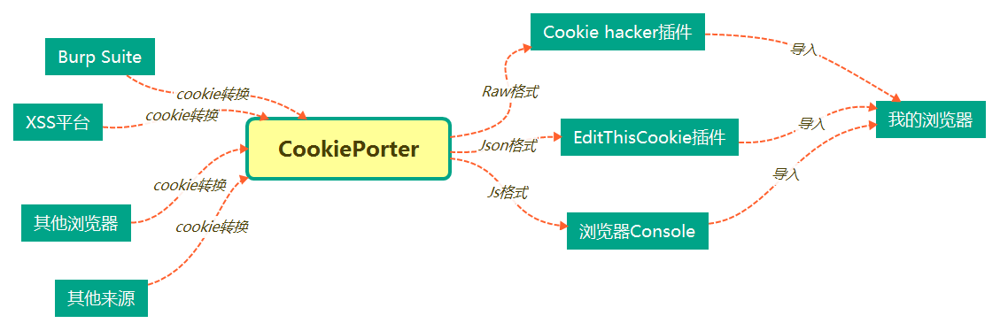
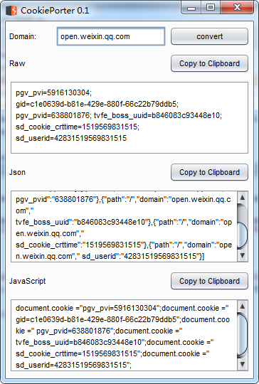

# burp-cookie-porter
一个可快速“搬运”cookie的Burp Suite插件

当我们需要将burp中的cookie复制到浏览器

当我们需要将XSS平台盗取到的cookie应用到浏览器

当我们想从火狐浏览器导出cookie，在导入chorme浏览器

......

那么让CookiePorter来帮你快速搬运吧！

## Raw格式
适合安装了[Cookie hacker](https://github.com/evilcos/cookiehacker)插件的chorme浏览器

## Json格式
适合安装了[EditThisCookie](https://github.com/fcapano/Edit-This-Cookie)插件的chorme内核浏览器

## console格式
适合所有浏览器，只要它有Console控制台就可以方便到入。

